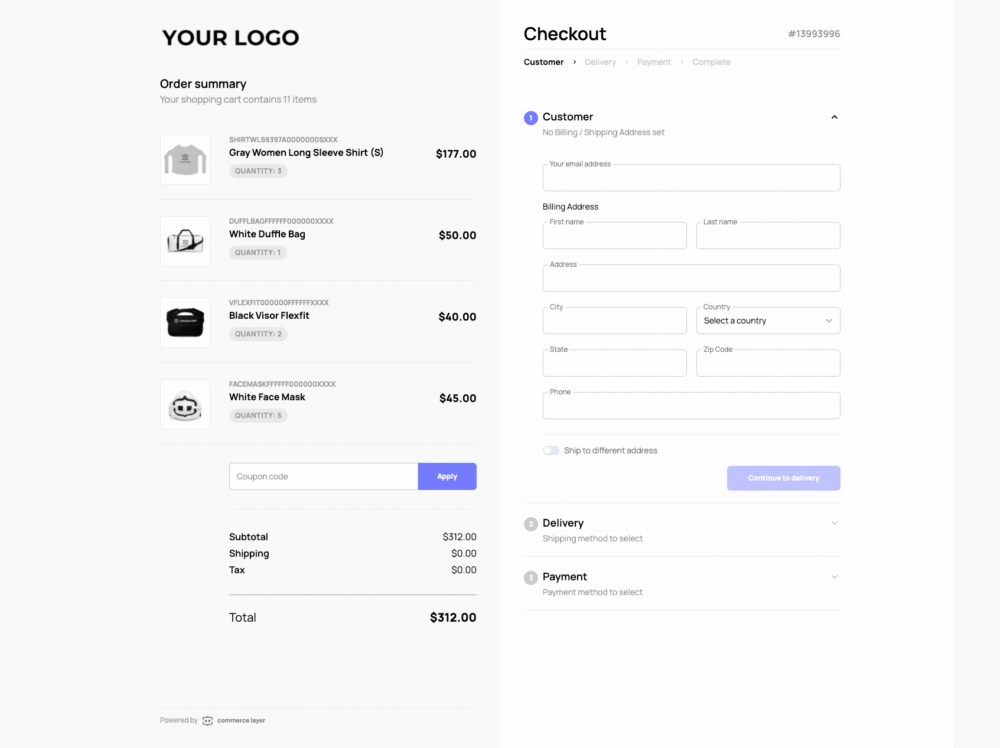

# Commerce Layer React Checkout

The Commerce Layer checkout application (React) provides you with a PCI-compliant, PSD2-compliant, and production-ready checkout flow powered by Commerce Layer APIs. You can fork this repository and deploy it to any hosting service or use it as a reference application to build your own.



## What is Commerce Layer?

[Commerce Layer](https://commercelayer.io) is a multi-market commerce API and order management system that lets you add global shopping capabilities to any website, mobile app, chatbot, wearable, voice, or IoT device, with ease. Compose your stack with the best-of-breed tools you already mastered and love. Make any experience shoppable, anywhere, through a blazing-fast, enterprise-grade, and secure API.

## Table of contents

- [Getting started](#getting-started)
- [Hosted version](#hosted-version)
- [Contributors guide](#contributors-guide)
- [Help and support](#need-help)
- [License](#license)

---

## Getting started

1. Deploy the forked repository to your preferred hosting service or host it yourself. You can deploy with one click below:

[](https://app.netlify.com/start/deploy?repository=https://github.com/commercelayer/commercelayer-react-checkout) [](https://vercel.com/new/clone?repository-url=https://github.com/commercelayer/commercelayer-react-checkout) [](https://heroku.com/deploy?template=https://github.com/commercelayer/commercelayer-react-checkout) [](https://cloud.digitalocean.com/apps/new?repo=https://github.com/commercelayer/commercelayer-react-checkout/tree/main) [](https://console.aws.amazon.com/amplify/home#/deploy?repo=https://github.com/commercelayer/commercelayer-react-checkout)

2. Create your organization and get your credentials by following this [credentials guide](https://docs.commercelayer.io/developers/credentials).

3. Build your sales channel with your favorite technologies and frameworks by leveraging our [developer resources](https://commercelayer.io/developers) and [documentation](https://docs.commercelayer.io/api).

4. Get an [access token](https://docs.commercelayer.io/api/authentication) for your application. You should generate this in your sales channel or use our Javascript [authentication library](https://github.com/commercelayer/commercelayer-js-auth).

5. Create an [order](https://docs.commercelayer.io/developers/v/api-reference/orders) associated with some line items.

6. Checkout the previously created order using the URL format: `<your-deployed-checkout-url>/:order_id?accessToken=<your-access-token>`. For example: `https://checkout.yourbrand.com/PrnYhoVeza?accessToken=eyJhbGciOiJIUzUxMiJ9`.

## Hosted version

There is a hosted version of the checkout application that is automatically enabled in your Commerce Layer account.  You can customize it by adding your organization logo, favicon, primary color, Google Tag Manager ID, support telephone, and email address.

You can use the hosted checkout with the following URL format: `https://<your-organization-subdomain>.checkout.commercelayer.app/:order_id?accessToken=<your-access-token>`.

For example: `https://yourbrand.checkout.commercelayer.app/PrnYhoVeza?accessToken=eyJhbGciOiJIUzUxMiJ9`

If you are using [Commerce Layer CLI](https://github.com/commercelayer/commercelayer-cli), you can leverage the [checkout plugin](https://github.com/commercelayer/commercelayer-cli-plugin-checkout/blob/main/README.md)  to generate the URL from an SKU code (using the `-S` flag), a bundle code `-B`, or from an order ID (using the `-O` flag):

```
commercelayer checkout -S <skuCode>:<quantity> --open
commercelayer checkout -B <bundleCode>:<quantity> --open
commercelayer checkout -O <orderId> --open
```

## Contributors guide

1. Fork [this repository](https://github.com/commercelayer/commercelayer-react-checkout) (you can learn how to do this [here](https://help.github.com/articles/fork-a-repo)).

2. Clone the forked repository like so:

```bash
git clone https://github.com/<your username>/commercelayer-react-checkout.git && cd commercelayer-react-checkout
```

3. First, install dependencies and run the development server:

```
yarn install
yarn dev
```

4. Set your environment with `.env.local` starting from `.env.local.sample`.

5. Open [http://localhost:3000](http://localhost:3000) with your browser to see the result. You can use the following format to open the checkout: `http://localhost:3000/:orderId?accessToken=<your-access-token>`.

6. Make your changes and create a pull request ([learn how to do this](https://docs.github.com/en/github/collaborating-with-issues-and-pull-requests/creating-a-pull-request)).

7. Someone will attend to your pull request and provide some feedback.

## Need help?

1. Join [Commerce Layer's Slack community](https://slack.commercelayer.app).

2. Create an [issue](https://github.com/commercelayer/commercelayer-react-checkout/issues) in this repository.

3. Ping us [on Twitter](https://twitter.com/commercelayer).

## License

This repository is published under the [MIT](LICENSE) license.
